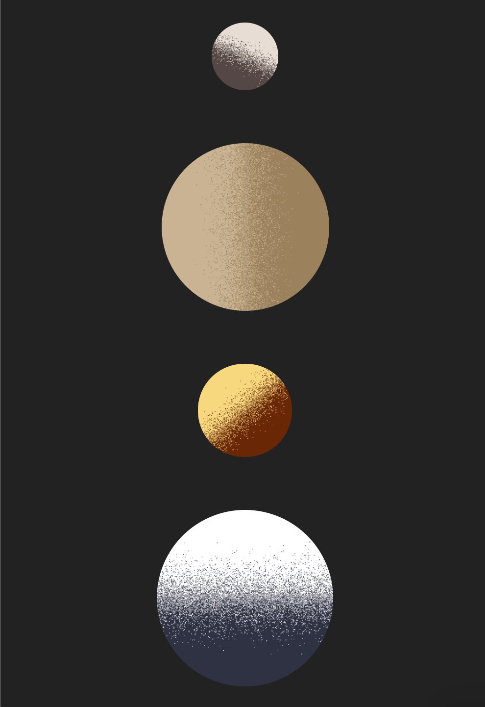

# Houdini / CSS Paint Speckled Gradients

Implementing a simple two-colour linear gradient at a given angle, using Perlin noise to determine likelihood of speckles of each colour.

It's also possible to pass in a "power" argument to determine the sharpness of the gradient.

## Running this example
Because the CSS Paint Worklet API requires loading a script from a given URL, it's an API only available on "secure" origins. This means either the page must be accessed from localhost, or from a URL beginning with "https://". 

So to run this locally, it's unfortunately not possible to open the index.html file – the "file" schema is not treated as a secure origin.

Instead, run a web server and navigate to `localhost:<chosen port>` using that server.
For example, if you have Python 3 installed, you can use `python3 -m http.server`, and navigate to `localhost:8000` in your browser.

## Example

Here's an example of some planets made using this paint worklet:

